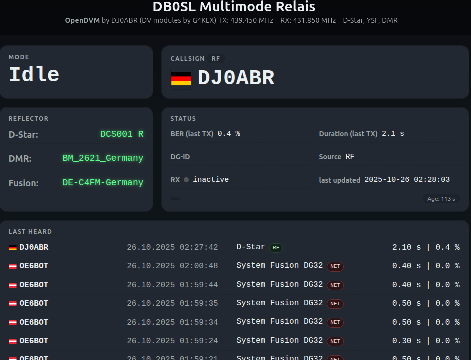

[🇬🇧 English](README.md) | [🇩🇪 Deutsch](README.de.md)

# 🛰️ OpenDVM MultiMode Repeater für Debian/Linux

Dieses Projekt baut auf den **Digital Voice (DV) Modulen von G4KLX** auf, die – ähnlich wie **Pi‑Star** – zu einer kompletten Lösung kombiniert werden.  
Allerdings ist Pi‑Star **ausschließlich für den Raspberry Pi** ausgelegt.

👉 **Ziel dieses Projekts** ist eine **voll funktionsfähige, plattformunabhängige Multimode‑Repeater‑Lösung**, die auf **jedem Debian‑basierten System** läuft – besonders zuverlässig auf echten PCs oder Servern (PC, Raspberry, Odroid, Orange Pi und viele weitere).

Es nutzt folgende Repositories von G4KLX:

- [MMDVMHost](https://github.com/g4klx/MMDVMHost)  
- [ircDDBGateway](https://github.com/g4klx/ircDDBGateway)  
- [DMRGateway](https://github.com/g4klx/DMRGateway)  
- [YSFClient](https://github.com/g4klx/YSFClients) *(als Gateway verwendet)*  

Die **gesamte Installation** wird über **vier Shell‑Skripte** automatisiert, die alle Komponenten korrekt einrichten.  

Zusätzlich enthält das Projekt einen **Logfile‑Parser**, der alle Betriebsdaten aus den MMDVM‑, YSF‑ und DMR‑Logs einliest und in eine **MariaDB‑Datenbank** schreibt.  
Diese Daten dienen als Backend für ein modernes **Web‑Dashboard**, das den Repeater‑ oder Hotspot‑Status in Echtzeit anzeigt.

Dieses Projekt wurde ursprünglich für das MMDVM Repeater Builder Board entwickelt, das im DB0SL Multimode Repeater verwendet wird. Für andere Hardware oder Anwendungsfälle passen Sie die Konfigurationsdateien nach Bedarf an (siehe den Abschnitt [Modem] in der MMDVMHost.ini).

---

## 📖 Inhaltsverzeichnis

1. [Überblick](#-überblick)  
2. [Architektur](#-architektur)  
3. [Backend – Log‑Monitor & Datenbank](#-backend--log-monitor--datenbank)  
4. [Installation & Abhängigkeiten](#-installation--abhängigkeiten)  
5. [Konfiguration](#-konfiguration)  
6. [Web-Frontend](#-web-frontend)  
7. [Systemeinrichtung & Wartung](#-systemeinrichtung--wartung)  
8. [Danksagungen & Lizenz](#-danksagungen--lizenz)

---

<a href="gui.png">
  
</a>

<a href="gui1.png">
  
</a>

🔗 **Live‑Installation:** [digital.db0sl.de](https://digital.db0sl.de/)

## 🔍 Überblick

**Hauptfunktionen:**

- Echtzeit‑Überwachung der Logs von MMDVMHost, YSFGateway und DMRGateway  
- Automatische Speicherung erkannter Ereignisse in MariaDB  
- Grafische Darstellung über ein modernes Web‑Frontend  
- Zentrale Konfiguration über eine einheitliche Datei `site.conf`  
- Automatische Generierung aller Gateway‑Konfigurationsdateien  
- Vollständig passwortloser, sicherer Datenbankzugriff  
- Keine Frameworks, keine Pi‑Abhängigkeit – läuft auf jedem Debian‑System

---

## ⚙️ Architektur


---

## 🚀 Schnellstart für alle die keine Anleitung lesen wollen

auf einem frischen System (Debian basiert, Ubuntu, Mint, Raspi, Odroid ...) gibt man der Reihe nach folgende Befehle ein. Aber tut euch den Gefallen auch den Rest der Anleitung zu lesen.

```bash
cd /opt
sudo git clone https://github.com/dj0abr/OpenDVM.git
cd OpenDVM
sudo ./install_serial.sh
sudo ./install_mm.sh
sudo ./install_ysf.sh
sudo ./install_irc.sh
sudo ./install_dmr.sh
cd configs
sudo cp site.conf.sample site.conf
sudo nano site.conf
sudo ./render-config
sudo reboot
```

## 🧠 Backend – Log‑Monitor & Datenbank

Das Hauptprogramm überwacht kontinuierlich folgende Logdateien:

- `/var/log/mmdvm/MMDVM-YYYY-MM-DD.log`  
- `/var/log/mmdvm/YSFGateway-YYYY-MM-DD.log`  
- `/var/log/mmdvm/DMRGateway-YYYY-MM-DD.log`

Neue Einträge werden sofort erkannt, geparst und in die Datenbank geschrieben.

### Erfasste Informationen

- TX‑Aktivitäten und Rufzeichen für D‑Star, DMR und System Fusion  
- Dauer und BER jeder Übertragung  
- Aktueller Betriebsmodus  
- Reflector‑Status für D‑Star, Fusion und DMR  
- Automatische Erkennung von Log‑Rotation und ‑Trunkierung  
- Verbindet sich nach Datenbankfehlern automatisch neu

### Datenbanktabellen

| Table | Description |
|--------|--------------|
| `status` | Aktueller Status (Mode, Callsign, RF/NET, Dauer, BER) |
| `lastheard` | Jede Übertragung mit Zeitstempel |
| `reflector` | Aktueller Reflector pro Mode |

### Besonderheiten

- Erkennung abgebrochener Übertragungen (heuristische Timing‑Logik)  
- Rufzeichen‑Validierung (mind. 3 Zeichen, mindestens 1 Ziffer)  
- D‑Star speichert keine DG‑ID, Fusion schon  
- „Watchdog expired“‑Meldungen gelten als EOT  
- DMR‑Masternamen (z. B. `BM_2621_Germany`) werden automatisch erkannt  

---

## 🧰 Installation & Abhängigkeiten

Die Installation erfolgt vollständig automatisiert über **fünf Shell‑Skripte**, die alle Abhängigkeiten, Programme und Konfigurationen installieren.

Als erstes lade dieses Repository von Github herunter:
```bash
cd /opt
sudo git clone https://github.com/dj0abr/OpenDVM.git
cd OpenDVM
```

Jetzt führe die fünf Scripts (alle mit `sudo`) wie folgt aus:

### Installationsreihenfolge

👉 **Wichtig:**  
Diese Skripte müssen **in dieser Reihenfolge** ausgeführt werden.

1. **Installiere den seriellen Port**  
   - Führe das Script aus:
   ```bash
   sudo ./install_serial.sh
   ```
   - Erkennt Ihr serielles Gerät (USB, Onboard‑UART etc.) und lässt Sie das richtige auswählen
   - führen Sie dieses Skript erneut aus, um auf ein anderes Gerät zu wechseln (z. B. neue Hardware)

2. **Installiere MMDVMHost**  
   - Führe das Script aus:
   ```bash
   sudo ./install_mm.sh
   ```
   - Installiert alle Systemabhängigkeiten  
   - Bereitet Verzeichnisse vor (z. B. `/var/log/mmdvm`)  
   - Richtet die MariaDB‑Datenbank ein  
   - Kompiliert und installiert das C++‑Backend  
   - Installiert die zentrale DV‑Schnittstelle **MMDVMHost**

3. **Installiere das YSF Gateway**  
   - Führe das Script aus:
   ```bash
   sudo ./install_ysf.sh
   ```
   - Installiert und konfiguriert das **System‑Fusion‑Gateway**

4. **Installiere das D-Star Gateway**  
   - Führe das Script aus:
   ```bash
   sudo ./install_irc.sh
   ```
   - Installiert und konfiguriert das **D‑Star‑Gateway**

5. **Installiere das DMR Gateway**  
   - Führe das Script aus:
   ```bash
   sudo ./install_dmr.sh
   ```
   - Installiert und konfiguriert das **DMR‑Gateway**

Nach Abschluss werden **Standard‑Konfigurationsdateien** automatisch nach `/etc` kopiert.  
Sie müssen anschließend an Ihre Umgebung angepasst werden – siehe [Konfiguration](#-Konfiguration).

---

## 🧾 Konfiguration

Alle Standort‑ und Systemparameter für die G4KLX‑Module werden in folgenden Konfigurationsdateien gespeichert:

   /etc/MMDVMHost.ini  
   /etc/ircddbgateway  
   /etc/ysfgateway  
   /etc/dmrgateway

Beispielversionen dieser Dateien sind in diesem Paket enthalten (mit der Endung .sample) und müssen an Ihre Station oder Ihren Repeater angepasst werden.

Zur Vereinfachung wurden die wichtigsten Parameter in die Datei **site.conf** ausgelagert.  
Diese enthält alle standortspezifischen Einstellungen wie Rufzeichen, Frequenzen, Koordinaten und Netzparameter.

Mit dem bereitgestellten Rendering‑Skript werden die Informationen aus der site.conf automatisch in die entsprechenden Abschnitte der G4KLX‑Konfigurationsdateien geschrieben.  
Bei besonderen Anforderungen oder erweiterten Einstellungen können Sie die Konfigurationsdateien weiterhin direkt bearbeiten.

Eine Vorlage für die site.conf befindet sich unter:

`
configs/site.conf.sample
`

### Schritte

1. **Vorlage kopieren:**
   ```bash
   cd configs
   sudo cp site.conf.sample site.conf
   ```

2. **Datei bearbeiten:**  
   Öffnen Sie `site.conf` in einem Editor und tragen Sie Ihre Daten ein (z. B. Rufzeichen, DMR‑ID, Frequenzen, Standort, BrandMeister‑Zugangsdaten usw.).
   ```bash
   sudo nano site.conf
   ```

3. **Konfiguration rendern:**
   ```bash
   sudo ./render-config
   ```
   Das Programm liest Ihre `site.conf` und füllt alle Werte automatisch in folgende Konfigurationsdateien ein:

   /etc/MMDVMHost.ini  
   /etc/ircddbgateway  
   /etc/ysfgateway  
   /etc/dmrgateway

   Vor jeder Änderung wird automatisch ein **Backup** erstellt:

   `
   file.bak-YYYYMMDD-HHMMSS
   `

4. **Abschließen:**  
   Nach dem Rendern ist die Installation abgeschlossen.  
   Sie können die generierten Dateien bei Bedarf weiter manuell anpassen – in der Regel ist das aber nicht notwendig.

5. **Neustart:**
   ```bash
   sudo reboot
   ```
   Nach dem Neustart ist das System voll einsatzbereit.

---

## 🌐 Web-Frontend

Das Web‑Frontend zeigt alle Betriebsdaten in Echtzeit an.  
Vollständig statisch – kein PHP‑Framework erforderlich, nur ein kleines `api.php` für die JSON‑Ausgabe.

### Features

- Live‑Status: Mode, Rufzeichen, Dauer, BER, RF/NET  
- Farbige Status‑Kacheln und Länderflaggen  
- Reflector‑Status für D‑Star, DMR, Fusion  
- „Last Heard“‑Liste mit Rufzeichen, Zeitstempel, Dauer  
- Aktivitätsdiagramm (48 h, RF/NET getrennt)  
- Balkenstatistik und 30‑Tage‑Heatmap  
- Reaktionsfähiges Dark‑UI  
- Einzige externe Bibliothek: **Chart.js**

### Technologie

- Reines Vanilla‑JavaScript  
- CSS‑Grid‑Layout  
- Aktualisierung jede Sekunde per AJAX  
- Funktioniert auf jedem Webserver (nginx, Apache, lighttpd)

---

## 🧱 Systemeinrichtung & Wartung

- Datenbankzugriff über Unix‑Socket  
- Installationsskripte legen Benutzer und Rechte automatisch an  

---

## 🎯 Danksagungen & Lizenz

- Jonathan Naylor G4KLX für seine herausragenden DV‑Implementierungen, die die Grundlage dieses Projekts bilden  
- Diese Software ist unter der **GPL v2** lizenziert und primär für den Amateurfunk sowie zu Ausbildungszwecken gedacht. Dieses Projekt enthält Komponenten von G4KLX unter GPL v2.  
Daher bleibt das Gesamtwerk unter GPL v2.