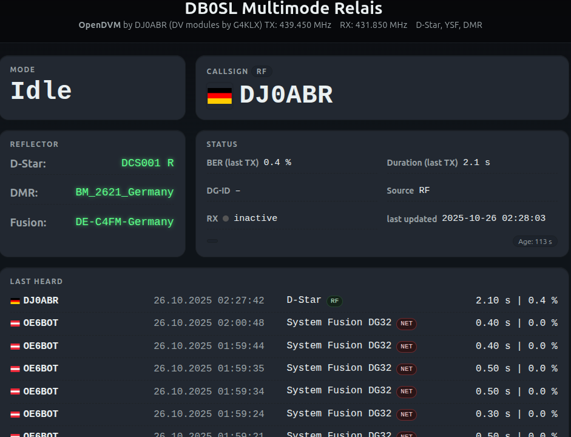
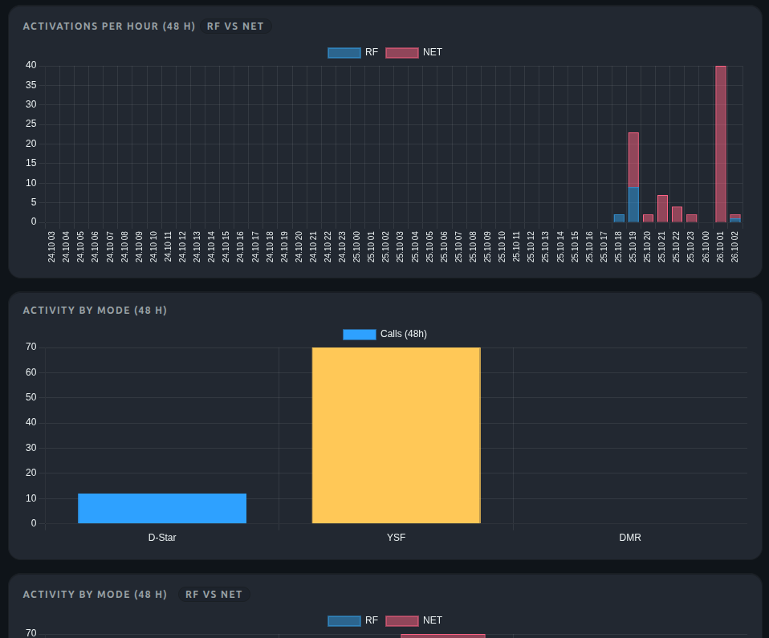
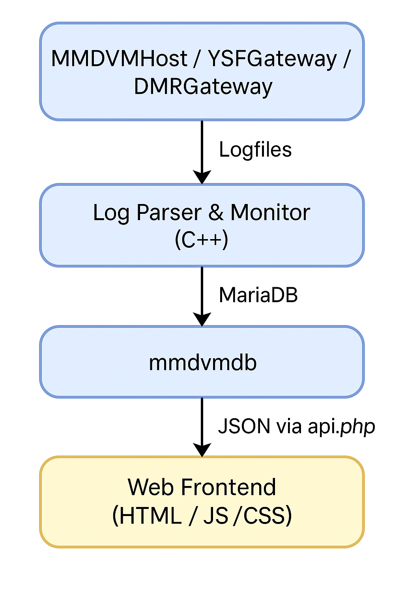

# 🛰️ MMDVM MultiMode Repeater for Debian/Linux

This project builds upon the **Digital Voice (DV) modules by G4KLX**, which are combined into a complete solution like **Pi-Star**.  
However, Pi-Star is designed **exclusively for the Raspberry Pi**.

👉 **The goal of this project** is to create a **fully functional, platform-independent multimode repeater solution** that runs on **any Debian-based system** – highly reliable on real PCs or servers (PC, Raspberry, Odroid, Orange Pi and many more).

It uses the following G4KLX repositories:

- [MMDVMHost](https://github.com/g4klx/MMDVMHost)  
- [ircDDBGateway](https://github.com/g4klx/ircDDBGateway)  
- [DMRGateway](https://github.com/g4klx/DMRGateway)  
- [YSFClient](https://github.com/g4klx/YSFClients) *(used as a gateway)*  

The **entire installation** is automated through **four shell scripts** that correctly set up all components.  

Additionally, the project includes a **logfile parser** that reads all operational data from MMDVM, YSF, and DMR logs and writes them into a **MariaDB database**.  
These data serve as the backend for a modern **web dashboard** that displays the repeater or hotspot status in real time.

This project was originally developed for the MMDVM Repeater Builder Board used in the DB0SL Multimode Repeater. For other hardware or use cases, adjust the configuration files as needed (see the [Modem] section in MMDVMHost.ini)

---

## 📖 Table of Contents

1. [Overview](#-overview)  
2. [Architecture](#-architecture)  
3. [Backend – Log Monitor & Database](#-backend--log-monitor--database)  
4. [Installation & Dependencies](#-installation--dependencies)  
5. [Configuration](#-configuration)  
6. [Web Frontend](#-web-frontend)  
7. [System Setup & Maintenance](#-system-setup--maintenance)  
8. [Credits & License](#-credits--license)

---

<a href="gui.png">
  
</a>

<a href="gui1.png">
  
</a>

🔗 **Live Installation:** [digital.db0sl.de](https://digital.db0sl.de/)

## 🔍 Overview

**Main features:**

- Real-time monitoring of MMDVMHost, YSFGateway, and DMRGateway logs  
- Automatic storage of detected events in MariaDB  
- Graphical presentation via a modern web frontend  
- Central configuration through a unified `site.conf` file  
- Automatic generation of all gateway configuration files  
- Fully passwordless, secure database access  
- No frameworks, no Pi dependency – runs on any Debian system

---

## ⚙️ Architecture



---

## 🧠 Backend – Log Monitor & Database

The main program continuously monitors the following log files:

- `/var/log/mmdvm/MMDVM-YYYY-MM-DD.log`  
- `/var/log/mmdvm/YSFGateway-YYYY-MM-DD.log`  
- `/var/log/mmdvm/DMRGateway-YYYY-MM-DD.log`

New entries are immediately detected, parsed, and written into the database.

### Captured Information

- TX activities and callsigns for D-Star, DMR, and System Fusion  
- Duration and BER of each transmission  
- Current mode of operation  
- Reflector status for D-Star, Fusion, and DMR  
- Automatic detection of log rotation and truncation  
- Reconnects automatically after database errors  

### Database Tables

| Table | Description |
|--------|--------------|
| `status` | Current status (mode, callsign, RF/NET, duration, BER) |
| `lastheard` | Every transmission with timestamp |
| `reflector` | Current reflector per mode |

### Special Features

- Detection of interrupted transmissions (heuristic timing)  
- Callsign validation (min. 3 characters, at least 1 digit)  
- D-Star does not store DG-ID, Fusion does  
- “Watchdog expired” messages are treated as EOT  
- DMR master names (e.g., `BM_2621_Germany`) are recognized automatically  

---

## 🧰 Installation & Dependencies

Installation is fully automated through **four shell scripts**, which install all dependencies, programs, and configuration files.

### Installation Order

1. **`install_mm.sh`**  
   - Installs all system dependencies  
   - Prepares directories (e.g., `/var/log/mmdvm`)  
   - Sets up the MariaDB database  
   - Compiles and installs the C++ backend  
   - Installs the central DV interface **MMDVMHost**

2. **`install_ysf.sh`**  
   - Installs and configures the **System Fusion Gateway**

3. **`install_irc.sh`**  
   - Installs and configures the **D-Star Gateway**

4. **`install_dmr.sh`**  
   - Installs and configures the **DMR Gateway**

👉 **Important:**  
These scripts must be executed **in this order**.

After completion, **default configuration files** are automatically copied to `/etc`.  
They must then be adjusted to match your setup – see [Central Configuration & Config Renderer](#-central-configuration--config-renderer).

---

## 🧾 Configuration

All site and system parameters for the G4KLX mdodules are stored in the following configuration files:

```
/etc/MMDVMHost.ini
/etc/ircddbgateway
/etc/ysfgateway
/etc/dmrgateway
```

Sample versions of these files are included in this package (with a .sample extension) and must be customized to match your station or repeater setup.

To simplify this process, the most important parameters have been extracted into the **site.conf** file.
This file contains all site-specific settings such as callsign, frequencies, coordinates, and network parameters.

Using the provided rendering script, the information from site.conf is automatically written into the corresponding sections of the G4KLX configuration files.
If you require special adjustments or advanced settings, you can still edit the configuration files directly.

A template for site.conf can be found at:

```
configs/site.conf.sample
```

### Steps

1. **Copy the template:**
   ```bash
   cd configs
   cp site.conf.sample site.conf
   ```

2. **Edit the file:**
   Open `site.conf` in a text editor and enter your own data (e.g. callsign, DMR ID, frequencies, site location, Brandmeister credentials, etc.).
   ```bash
   nano site.conf
   ```

3. **Render the configuration:**
   ```bash
   sudo ./render-config
   ```
   The program reads your `site.conf` and automatically fills all values into the following configuration files:

   ```
   /etc/MMDVMHost.ini
   /etc/ircddbgateway
   /etc/ysfgateway
   /etc/dmrgateway
   ```

   Before any modification, a **backup** is automatically created:
   ```
   file.bak-YYYYMMDD-HHMMSS
   ```

4. **Finalize:**
   After rendering, the installation is complete.  
   You can still manually adjust the generated files if needed – but that’s usually not necessary.

5. **Reboot:**
   ```bash
   sudo reboot
   ```
   After reboot, the system is fully operational.

---

## 🌐 Web Frontend

The web frontend displays all operational data in real time.  
Completely static – no PHP framework required, just a small `api.php` for JSON output.

### Features

- Live status: mode, callsign, duration, BER, RF/NET  
- Colored status tiles and country flags  
- Reflector status for D-Star, DMR, Fusion  
- “Last Heard” list with callsign, timestamp, duration  
- Activity chart (48h, RF/NET separated)  
- Bar statistics and 30-day heatmap  
- Responsive dark UI  
- Only external library: **Chart.js**

### Technology

- Pure Vanilla JavaScript  
- CSS grid layout  
- Updates every second via AJAX  
- Works on any webserver (nginx, Apache, lighttpd)

---

## 🧱 System Setup & Maintenance

- Database runs via Unix socket (`bind-address=127.0.0.1`)  
- Installation scripts automatically create users and permissions  
- No sensitive data in the repo (`site.conf` is in `.gitignore`)  

---

## 🎯 Credits & License

- Jonathan Naylor G4KLX, for his outstanding DV implementations that form the foundation of this project  
- This software is licensed under **GPL v2** and is primarily intended for amateur radio and educational use.
